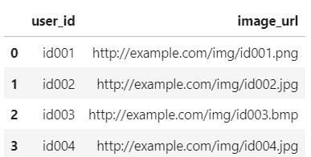
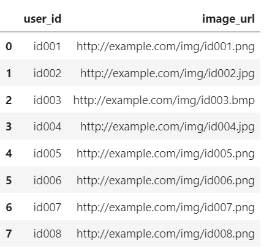

## Задачи из юнитов модуля PYTHON-12 (Pandas) ##

#### **Задание 6.3** ####

Предоставлена директория `./Root/users/`. В данной директории содержатся
csv-файлы, в каждом из которых хранится информация об идентификаторах
пользователей (`user_id`) и ссылки на их фотографии (`photo_url`). Каждый файл
из папки users имеет примерно следующую структуру:



При проверке в директории может быть сколько угодно файлов (директория может
изменяться в зависимости от устройства файловой системы).

Необходимо написать функцию `concat_user_files(path)`, параметром которой
является `path`&nbsp;&mdash; путь до директории. Функция должна объединить
информацию из предоставленных файлов в один **DataFrame** и вернуть его.

Список названий всех файлов, находящихся в директории, можно получить с помощью
функции `os.listdir(path)` из модуля `os` (модуль уже импортирован в файле
`main.py`). Например, для директории `./Root/users/` результатом работы функции
будет список:

```text
print(os.listdir('./Root/users/'))
['users2.csv', 'users1.csv', 'users3.csv']
```

**Примечание**.    
Модуль `os` позволяет работать с операционной системой компьютера прямо из кода.

Отсортировать этот список, прежде чем производить объединение файлов.    
Когда получится отсортированный список, останется только прочитать все csv-файлы
из списка в цикле и объединить прочитанные таблицы между собой.

Однако надо обратить внимание, что метод `os.listdir()` возвращает только список
имён файлов в указанной директории, а при чтении файла необходимо указывать
полный путь до него. То есть путь для чтения будет таким:    
`./Root/users/{file_name}`

Не забыть обновить индексы результирующей таблицы после объединения.    
Учесть, что на тестовом наборе файлов в результате объединения могут возникнуть
дубликаты, от которых необходимо будет избавиться.    
Например, для директории `./Root/users/` результирующая таблица должна иметь
следующий вид:



```python
import os
import pandas as pd

# DIR = 'D:\\Course\\Mod-12\\Task63\\'
DIR = '~/Course/01-15-PYTHON-12/Task63'

def concat_users_files(path_):
    file_list = os.listdir(path=path_)
    file_list.sort()
    for index in range(len(file_list)):
        file_list[index] = path_ + '/' + file_list[index]
    df = pd.read_csv(file_list[0], sep=',')
    if len(file_list) > 1:
        for file_path in file_list[1:]:
            df_add = pd.read_csv(file_path, sep=',')
            df = pd.concat([df, df_add], ignore_index=True)
    df.drop_duplicates(inplace=True, ignore_index=True)
    return df


if __name__ == '__main__':
    data = concat_users_files(DIR)
    print(data)
```

---

#### **Задание 7.5** ####

Даны две таблицы: `items_df`, в которой содержится информация о наличии товаров
на складе, и `purchase_df`&nbsp;&mdash; с данными о покупках товаров.    
Информация в таблицах представлена в виде следующих столбцов:

- `item_id`&nbsp;&mdash; идентификатор модели;
- `vendor`&nbsp;mdash; производитель модели;
- `stock_count`&nbsp;&mdash; имеющееся на складе количество данных моделей (в
штуках);
- `purchase_id`&nbsp;&mdash; идентификатор покупки;
- `price`&nbsp;&mdash; стоимость модели в покупке.

Сформировать **DataFrame merged**, в котором в результате объединения
`purchase_df` и `items_df` останутся модели, которые учтены на складе и имели
продажи.

Из таблицы `merged` найти суммарную выручку, которую можно было бы получить от
продажи всех товаров, которые учтены на складе и имели продажи. Результат
занести в переменную `income`.

```python
import pandas as pd

items_df = pd.DataFrame({
    'item_id': [417283, 849734, 132223, 573943, 19475, 3294095, 382043, 302948, 100132, 312394], 
    'vendor': ['Samsung', 'LG', 'Apple', 'Apple', 'LG', 'Apple', 'Samsung', 'Samsung', 'LG', 'ZTE'],
    'stock_count': [54, 33, 122, 18, 102, 43, 77, 143, 60, 19]
})

purchase_df = pd.DataFrame({
    'purchase_id': [101, 101, 101, 112, 121, 145, 145, 145, 145, 221],
    'item_id': [417283, 849734, 132223, 573943, 19475, 3294095, 382043, 302948, 103845, 100132], 
    'price': [13900, 5330, 38200, 49990, 9890, 33000, 67500, 34500, 89900, 11400]
})

merged = items_df.merge(purchase_df, on='item_id', how='inner')

merged['total'] = merged['price'] * merged['stock_count']
income = merged['total'].sum()
print(income)
# 19729490
```
