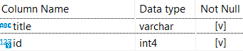
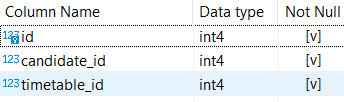
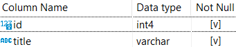
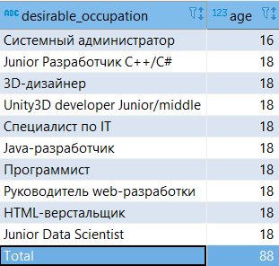

# Анализ вакансий из HeadHunter #

## (Подгрузка новых данных, уточнение анализа) ##

### Содержание ###

[1. Организационная информация](#организационная-информация)    
[2. Знакомство с датасетом](#знакомство-с-датасетом)    
[3. Предварительный анализ данных](#предварительный-анализ-данных)    
[4. Глобальный анализ показателей](#глобальный-анализ-показателей)    
[5. Анализ кандидатов](#анализ-кандидатов)    

### Организационная информация ###

Проект состоит из четырёх этапов:

1. [Знакомство с датасетом](#знакомство-с-датасетом)
2. [Предварительный анализ данных](#предварительный-анализ-данных)
3. [Глобальный анализ показателей](#глобальный-анализ-показателей)
4. [Анализ кандидатов](#анализ-кандидатов)

В качестве итогового задания проекта надо подготовить
**текстовый Google-документ**, в котором по каждой встречающейся задаче привести
ответ в формате:

- номер задания;
- код с пояснениями;
- результат запроса (в виде таблицы);
- общий вывод в конце по результатам анализа рынка труда.

[:arrow_up: Содержание](#содержание)

----

### Знакомство с датасетом ###

В датасете 4 таблицы:


#### candidate ####

    
Таблица хранит в себе общие данные по кандидатам: `id`, пол, возраст, желаемая
должность, город, вид занятости, текущая должность, дата обновления записи и
зарплата.

#### city ####

    
Таблица-справочник для кандидатов&nbsp;&mdash; хранит код города и его название.

#### candidate_timetable_type ####

    
Это дополнительная таблица. Она существует для организации связи
многие-ко-многим, так как у нас есть много кандидатов и у них может быть
несколько подходящих типов рабочего графика.    

***Примечание***    
Стоило бы вынести в дополнительную таблицу и колонку `employment_type` из
таблицы **`candidate`**, так как вид связи здесь одинаковый, но решили оставить
всё как есть, так как это даст дополнительные возможности для постановки
интересных задач и проведения изысканий.

#### timetable_type ####

    
Это таблица-справочник вариантов рабочего графика, подходящего кандидату.

[:arrow_up: Содержание](#содержание)

----

### Предварительный анализ данных ###

#### Задание 2.1 ####

Рассчитать максимальный возраст (`max_age`) кандидата в таблице.

```sql
SELECT
    MAX(age) AS max_age
FROM hh.candidate
```

Ответ: 100

#### Задание 2.2 ####

Теперь рассчитать минимальный возраст (`min_age`) кандидата в таблице.

```sql
SELECT
    MIN(age) AS min_age
FROM hh.candidate
```

Ответ: 14

#### Задание 2.3 ####

Попытка &laquo;почистить&raquo; данные.    
Написать запрос, который позволит посчитать для каждого возраста (**`age`**),
сколько (**`cnt`**) человек этого возраста есть в базе.    
Отсортировать результат по возрасту в обратном порядке.

```sql
SELECT
    age,
    COUNT(*)
FROM hh.candidate
GROUP BY age
ORDER BY age DESC
```

#### Задание 2.4 ####

По данным Росстата, средний возраст занятых в экономике России составляет
**39.7** лет. Округлим это значение до **40**. Найти количество кандидатов,
которые старше данного возраста. Не забыть отфильтровать &laquo;ошибочный&raquo;
возраст **100**.

```sql
SELECT
    COUNT(*)
FROM hh.candidate
WHERE age BETWEEN 41 AND 99
```

Ответ: 6263

[:arrow_up: Содержание](#содержание)

----

### Глобальный анализ показателей ###

#### Задание 3.1 ####

Для начала написать запрос, который позволит узнать, сколько (`cnt`) кандидатов
из каждого города (`city`).Формат выборки: `city`, `cnt`. Группировку таблицы
необходимо провести по столбцу `title`, результат отсортировать по количеству в
обратном порядке.

#### Задание 3.2 ####

Москва бросается в глаза как, пожалуй, самый активный рынок труда. Написать
запрос, который позволит понять, каких кандидатов из Москвы устроит &laquo;проектная
работа&raquo;. Формат выборки: `gender`, `age`, `desirable_occupation`, `city`,
`employment_type`. Отсортировать результат по `id` кандидата.

#### Задание 3.3 ####

Данных оказалось многовато. Отфильтровать только самые популярные
IT-профессии&nbsp;&mdash; разработчик, аналитик, программист.    
Обратить внимание, что данные названия могут быть написаны как с большой, так и
с маленькой буквы. Отсортировать результат по `id` кандидата.

#### Задание 3.4 ####

Для общей информации попробовать выбрать номера и города кандидатов, у которых
занимаемая должность совпадает с желаемой. Формат выборки: `id`, `city`.
Отсортировать результат по городу и `id` кандидата.

#### Задание 3.5 ####

Определить количество кандидатов пенсионного возраста.    
Пенсионный возраст для мужчин наступает в 65 лет, для женщин&nbsp;&mdash;
в 60 лет.

```sql
SELECT
    COUNT(*)
FROM hh.candidate
WHERE
    gender = 'M' AND (age BETWEEN 65 AND 99)
    OR
    gender = 'F' AND (age BETWEEN 60 AND 99)
```

Ответ: 75

[:arrow_up: Содержание](#содержание)

----

### Анализ кандидатов ###

#### Задание 4.1 ####

Для добывающей компании необходимо подобрать кандидатов из Новосибирска, Омска,
Томска и Тюмени, которые готовы работать вахтовым методом. Формат выборки:
`gender`, `age`, `desirable_occupation`, `city`, `employment_type`,
`timetable_type`. Отсортировать результат по городу и номеру кандидата.

#### Задание 4.2 ####

Для заказчиков из Санкт-Петербурга необходимо собрать список из 10 желаемых
профессий кандидатов из того же города от 16 до 21 года (в выборку включается 16
и 21, сортировка производится по возрасту) с указанием их возраста, а также
добавить строку `Total` с общим количеством таких кандидатов. Напишите запрос,
который позволит получить выборку вида:    


[:arrow_up: Содержание](#содержание)

----
