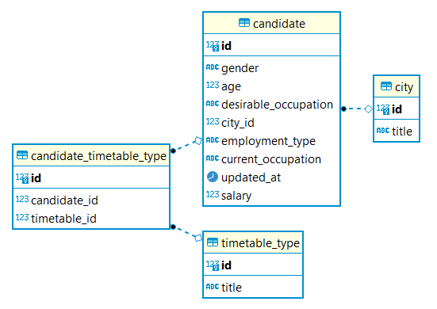
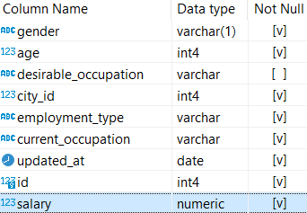

# Анализ вакансий из HeadHunter #

## (Подгрузка новых данных, уточнение анализа) ##

### Содержание ###

[1. Организационная информация](#организационная-информация)    
[2. Знакомство с датасетом](#знакомство-с-датасетом)    
[3. Предварительный анализ данных](#предварительный-анализ-данных)    
[4. Анализ кандидатов](#анализ-кандидатов)    
[5. Глобальный анализ показателей](#глобальный-анализ-показателей)    

### Организационная информация ###

Проект состоит из четырёх этапов:

1. [Знакомство с датасетом](#знакомство-с-датасетом)
2. [Предварительный анализ данных](#предварительный-анализ-данных)
3. [Анализ кандидатов](#анализ-кандидатов)
4. [Глобальный анализ показателей](#глобальный-анализ-показателей)

В качестве итогового задания проекта надо подготовить
**текстовый Google-документ**, в котором по каждой встречающейся задаче привести
ответ в формате:

- номер задания;
- код с пояснениями;
- результат запроса (в виде таблицы);
- общий вывод в конце по результатам анализа рынка труда.

[:arrow_up: Содержание](#содержание)

----

### Знакомство с датасетом ###

В датасете 4 таблицы:



#### candidate ####

    
Таблица хранит в себе общие данные по кандидатам: `id`, пол, возраст, желаемая
должность, город, вид занятости, текущая должность, дата обновления записи и
зарплата.

#### city ####

Таблица-справочник для кандидатов&nbsp;&mdash; хранит код города и его название.

[:arrow_up: Содержание](#содержание)

----

### Предварительный анализ данных ###

#### Задание 2.3 ####

Попытка &laquo;почистить&raquo; данные.    
Написать запрос, который позволит посчитать для каждого возраста (**`age`**),
сколько (**`cnt`**) человек этого возраста есть в базе.    
Отсортировать результат по возрасту в обратном порядке.

```sql
SELECT
    age,
    COUNT(*)
FROM hh.candidate
GROUP BY age
ORDER BY age DESC
```

#### Задание 2.4 ####

По данным Росстата, средний возраст занятых в экономике России составляет
**39.7** лет. Округлим это значение до **40**. Найти количество кандидатов,
которые старше данного возраста. Не забыть отфильтровать &laquo;ошибочный&raquo;
возраст **100**.

```sql
SELECT
    COUNT(*)
FROM hh.candidate
WHERE age BETWEEN 41 AND 99
```

Ответ: 6263

[:arrow_up: Содержание](#содержание)

----

### Анализ кандидатов ###

[:arrow_up: Содержание](#содержание)

----

### Глобальный анализ показателей ###

#### Задание 3.5 ####

Определить количество кандидатов пенсионного возраста.    
Пенсионный возраст для мужчин наступает в 65 лет, для женщин&nbsp;&mdash;
в 60 лет.

```sql
SELECT
    COUNT(*)
FROM hh.candidate
WHERE
    gender = 'M' AND (age BETWEEN 65 AND 99)
    OR
    gender = 'F' AND (age BETWEEN 60 AND 99)
```

Ответ: 75

[:arrow_up: Содержание](#содержание)

----
