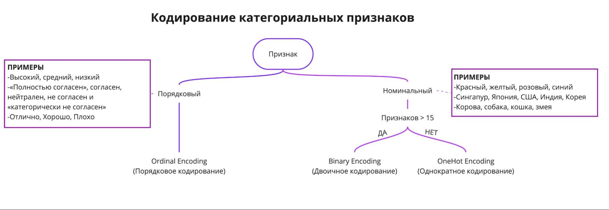
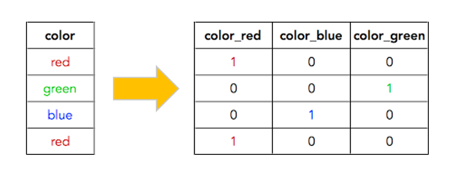
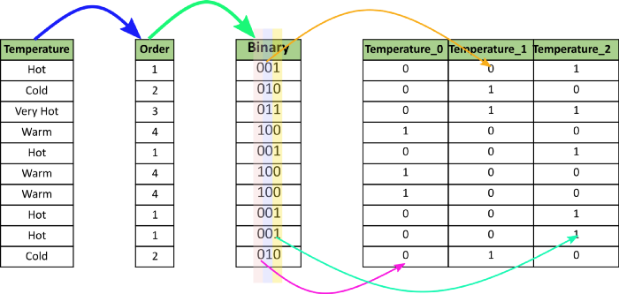

## Некоторые термины и определения модуля EDA-3 (Проектирование признаков) ##

**Проектирование признаков (Feature Engineering)**&nbsp;&mdash; также называют
**конструированием признаков** или **разработкой признаков**. Все эти термины
описывают процесс создания признаков, которые нужны для обучения модели.

**Этапы проектирования признаков**

1. Создание признаков (feature extraction), генерация признаков
2. Преобразование признаков
3. Отбор признаков

### Кодирование категориальных признаков ###

### Однократное кодирование (One-Hot Encoding) ###

### Двоичное кодирование ###

----

**Нормализация**&nbsp;&mdash; один из методов преобразования входных признаков,
при котором значения признаков приводятся к заданному диапазону, например [0-1].

[**`MinMaxScaler()`**](https://scikit-learn.org/stable/modules/generated/sklearn.preprocessing.MinMaxScaler.html)&nbsp;&mdash;
При применении нормализации методом **MinMaxScaler** все значения признаков
будут преобразованы в диапазон [0-1], что означает, что минимальное и
максимальное значение признака будет равно 0 и 1 соответственно. Поскольку
использует в своём вычислении минимальное и максимальное значения признака, то
этот способ будет чувствителен к наличию выбросов в распределении.

[**`RobustScaler()`**](https://scikit-learn.org/stable/modules/generated/sklearn.preprocessing.RobustScaler.html)&nbsp;&mdash;
Сначала из каждого значения признака вычитается медиана признака, затем
полученное значение делится на межквартильный размах. Не масштабирует данные в
заданный интервал, как делает это **MinMaxScaler**. В вычислении использует
перцентили, и поэтому не зависит даже от большого количества выбросов.

----

**Стандартизация**&nbsp;&mdash; ещё один метод преобразования входных признаков,
при котором изменяется распределение таким образом, чтобы среднее значений
равнялось 0, а стандартное отклонение&nbsp;&mdash; 1. Как и **нормализация**,
**стандартизация** может быть полезна при данных с разными масштабами. Однако в
отличие от нормализации стандартизация предполагает, что признак распределён
нормально.

[**`StandardScaler()`**](https://scikit-learn.org/stable/modules/generated/sklearn.preprocessing.StandardScaler.html)&nbsp;&mdash;
для этого.

----

**Инструкция по преобразованию признаков:**

- если признак распределён нормально, то его необходимо стандартизировать;
- если признак распределён ненормально, его необходимо нормализовать;
- если разброс значений небольшой, то можно обойтись без преобразования данных.

----

### Отбор признаков (Зачем?) ###

1. **Сокращение времени обучения**. Чем меньше данных, тем быстрее обучается
модель.
2. **Повышение качества предсказания**. Избыточные данные могут снижать точность
предсказания, могут выступать в качестве &laquo;шума&raquo;
(**мультиколлинеарность**).

Можно удалить любой признак из пары. Однако лучше оставить в наборе данных тот
признак, который легче будет использовать в дальнейшем. Например, для него не
понадобится округление или нормализация.

----
