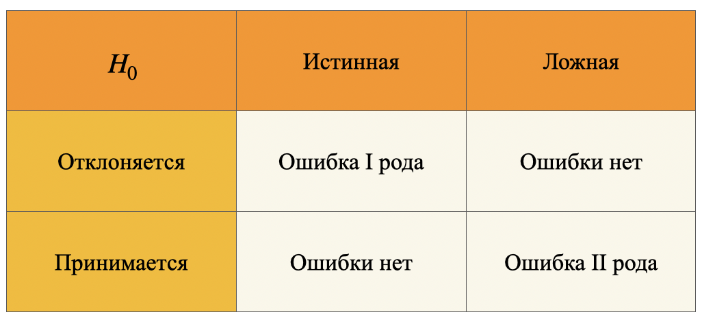
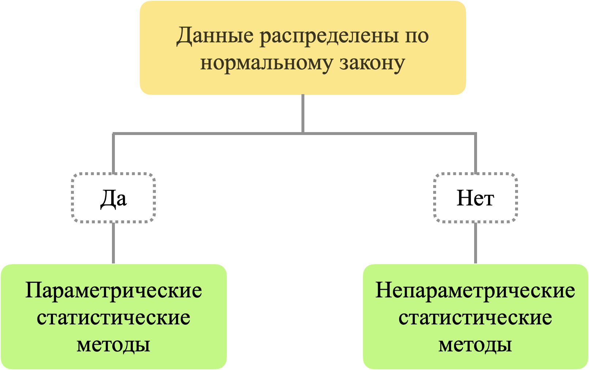

## Некоторые термины и определения модуля EDA-4 (Статистические тесты) ##

**Статистическая гипотеза**&nbsp;&mdash; гипотеза о распределении вероятностей,
лежащем в основе наблюдаемой выборки данных. Для математической проверки
переформулируется в нулевую ($H_0$) и альтернативную ($H_1$) гипотезы.

**Алгоритм проверки гипотезы**

1. Изложение исследовательской гипотезы как нулевой ($H_0$) и альтернативной
($H_a$) гипотезы.
2. Выбор уровня значимости ($\alpha$).
3. Сбор данных для проверки гипотезы.
4. Выполнение соответствующего статистического теста: вычисление ***p-value*** и
сравнение его с уровнем значимости.
5. Формулировка вывода: отклонить или не отклонять нулевую гипотезу.

----

**Нулевая гипотеза $H_0$**&nbsp;&mdash; отсутствие разницы между параметрами или
распределениями выборки. Математически формулируется в виде равенства.

----

**Альтернативная гипотеза $H_1$**&nbsp;&mdash; как правило, исходная гипотеза,
предсказывающая взаимосвязь между переменными.

----

**Ошибка I рода**&nbsp;&mdash; Отклонение истинной $H_0$ (нулевой гипотезы).

Например, на основе полученных данных можно принять решение, что вариант **`B`**
является более предпочтительным, чем **`A`**, однако такая разница была
обусловлена лишь случайностью или внешними факторами.

**Ошибка II рода**&nbsp;&mdash; Принятие ложной $H_0$ (нулевой гипотезы).

Например, на основе полученных данных можно принять решение, что для
пользователей нет разницы между вариантами **`А`** и **`В`**, хотя на самом деле
произведено некорректное сравнение и вариант **`В`** был лучшим.

**Синим** представлено распределение нулевой гипотезы, которое показывает все
возможные результаты, которые можно получить, если нулевая гипотеза верна.
Правильный вывод для любой точки этого распределения&nbsp;&mdash; не отвергать
нулевую гипотезу.

**Зелёным** представлено распределение альтернативной гипотезы, которое
показывает все возможные результаты, которые можно получить, если альтернативная
гипотеза верна. Правильный вывод для любой точки этого распределения означает
отказ от нулевой гипотезы.

Ошибки типа I и типа II возникают там, где эти два распределения
**перекрываются**. Область, заштрихованная синим цветом, представляет $\alpha$,
частоту ошибок I рода, а область, заштрихованная зелёным цветом, представляет
собой $\beta$, частоту ошибок типа II.

----

**Статистическая значимость** ***p-value***&nbsp;&mdash; вероятность обнаружения
наблюдаемых результатов гипотезы $H_1$, когда нулевая гипотеза $H_0$ верна
(или **вероятность ошибки I рода**).

**Уровень значимости $\alpha$**&nbsp;&mdash; фиксированная вероятность
ошибочного отклонения истинной нулевой гипотезы, то есть вероятность ошибки
I рода.

Если в тесте ***p-value*** < $\alpha$, это означает, что результаты
статистически значимы и согласуются с альтернативной гипотезой $H_1$.

Если в тесте ***p-value*** > $\alpha$, то результаты считаются статистически
незначимыми и принимается нулевая гипотеза $H_0$ (не может быть отвергнута).

----

**Вероятность ошибки II рода $\beta$**&nbsp;&mdash; определяет риск
ложноотрицательного результата.

**Мощность теста $=1-\beta$** (вероятность не допустить ошибки II рода).

----

### Статистические тесты на нормальность распределения ###

1. Тест Шапиро-Уилка (scipy.stats.shapiro)
2. Тест Д'Агостино $\chi^2$ (scipy.stats.normaltest)

----

### Корреляционные тесты (параметрические) ###

----

### Корреляционные тесты (непараметрические) ###

----

### Тесты на сравнение выборок ###

----

### Общая схема тестов ###

----

## Новые дополнения ##

**Генеральная совокупность**&nbsp;&mdash; всё множество интересующих объектов.

**Выборка**&nbsp;&mdash; случайное подмножество генеральной выборки.

**Выборочная статистика**&nbsp;&mdash; случайная величина, так как рассчитана на
случайной выборке. Например, значение среднего на двух разных выборках будет
разным.

**Параметр генеральной совокупности**&nbsp;&mdash; константа, конкретное число,
которое, как правило, нам неизвестно и никогда не станет известным.

- Статистические тесты позволяют сделать выводы о всей генеральной совокупности
по выборке.
- Статистические тесты нужны в случаях, когда мы не можем измерить все объекты в
генеральной совокупности.
- Без статистических тестов выводы, полученные на выборке, нельзя распространить
на всю генеральную совокупность.

**Статистическая гипотеза**&nbsp;&mdash; некоторое утверждение о параметрах
генеральной совокупности, которое проверяется на основе данных выборки.
Например, утверждение &laquo;рекомендательная система влияет на средний чек
покупки&raquo;&nbsp;&mdash; это статистическая гипотеза.

----

**Алгоритм проверки статистических гипотез**

1. Построение нулевой и альтернативной гипотез.
2. Выбор уровня значимости **$\alpha$**.
3. Сбор данных для проверки гипотезы.
4. Выбор статистического теста.
5. Проведение статистического теста, вычисление ***p-value***.
6. Сравнение ***p-value*** c уровнем значимости и вывод, отклонить или не
отклонить нулевую гипотезу.

----

**Нулевая гипотеза $H_0$**&nbsp;&mdash; обычно утверждение об **отсутствии
эффекта**, то есть тех изменений, которых мы ожидали, нет. (Например:
рекомендательная система не влияет на средний чек покупки)

----

**Альтернативная гипотеза $H_1$**&nbsp;&mdash; утверждение о **наличии эффекта**
(обратное нулевой гипотезе), то есть те изменения, которых мы ожидали, есть.
(Например: рекомендательная система влияет на средний чек покупки.)

----

**Kernel Density Estimation, KDE (График оценки плотности ядрв)**&nbsp;&mdash;
непрерывная кривая, которая показывает распределение значений, и выглядит как
сглаженная гистограмма. По такому графику проще понять форму распределения
(пики, симметричность), чем по гистограмме.

----

**Уровень значимости $\alpha$**&nbsp;&mdash; пороговая вероятность допустить
ошибку I рода (вероятность отклонить нулевую гипотезу, когда она верна).

----

**Статистическая значимость** ***p-value***&nbsp;&mdash; вероятность получить
наблюдаемые или более экстремальные значения при условии, что нулевая гипотеза
верна.

**Важно понимать, что** ***p-value***&nbsp;&mdash; **это именно вероятность
получить наблюдаемые или более экстремальные значения, если верна нулевая
гипотеза, а не вероятность верности нулевой гипотезы.**

----
