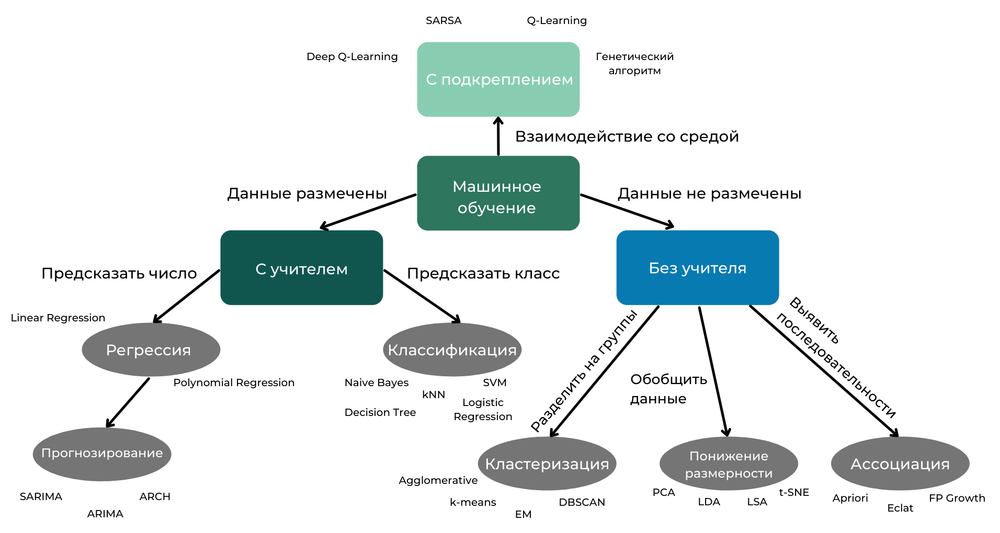

## Некоторые термины и определения модуля ML-1 (Теория машинного обучения) ##

**Искусственный интеллект (Artificial Intelligence)**&nbsp;&mdash; способность
компьютерной системы имитировать когнитивные функции человека, такие как
обучение и решение задач. AI позволяет компьютеру моделировать рассуждения людей
для получения новых сведений и принятия решений.

**Слабый ИИ (Weak AI)** способен решать только одну задачу. В качестве примера
слабого ИИ можно назвать `Deep Blue`. Но `Deep Blue` не умеет делать ничего
другого и никогда этому не научится. Слабый ИИ используют в медицине, логистике,
банковском деле, бизнесе.

**Сильный ИИ (Strong AI)** пока остаётся мечтой. Это интеллект, который решает
множество задач и умеет обучаться для решения других. Сильный ИИ осознаёт себя и
своё существование.

**Подразделы искусственного интеллекта**

- Робототехника (Robotics)
- Компьютерное зрение (Computer Vision)
- Обработка естественного языка (Natural Language Processing)
- Машинное обучение (Machine Learning).

----

**Машинное обучение (Machine Learning)**&nbsp;&mdash; один из разделов науки об
искусственном интеллекте. Машинное обучение заключается в построении моделей с
помощью поиска закономерностей в данных и использовании их для того, чтобы
спрогнозировать характеристики новых данных.

### Составные части ML ###

1. **Набор данных (dataset)**&nbsp;&mdash; множество примеров (выборка), на
котором происходит обучение модели. Это могут быть табличные данные, текст,
аудио, изображения (видео).
2. **Признаки (features)**&nbsp;&mdash; свойства, характеристики, которыми
описываются объекты. Признак, который надо предсказать, называется
**целевым признаком (target feature)**. Иногда признаки, на основе которых надо
предсказать целевой, могут называться **факторами (factors)**.
3. **Модель машинного обучения (ML-model)**&nbsp;&mdash; некоторый математически
формализованный метод (алгоритм) описания зависимости в данных. Как правило,
модель имеет настраиваемые (регулируемые) параметры. В простом понимании
модель&nbsp;&mdash; математическая формула, которая связывает факторы с целевым
признаком. В более обширном понимании модель может выражаться не
формулой&nbsp;&mdash; это может быть математически описанная последовательность
действий (алгоритм). Управляя своими параметрами, модель подстраивается под
зависимости в данных, чтобы описать эту зависимость и свести ошибку в
предсказаниях к минимуму. Такой процесс называется
**обучением модели (model learning)**.

----

За управление параметрами отвечает некоторая **функция ошибки**, или, как её ещё
называют, **функция потерь (loss function)**. Это некоторая математическая
функция, которая показывает различие между фактическими ответами и
предсказаниями модели.

Самый простой пример функции ошибки&nbsp;&mdash; **MSE (Mean Squared Error)**,
средний квадрат разницы между ответами. Формально она записывается следующим
образом:
$$MSE=\frac{1}{n}\displaystyle\sum_{i=1}^n(y_i-\widehat{y_i})^2,$$
где $y$&nbsp;&mdash; истинные ответы, $\widehat{y}$&nbsp;&mdash; предсказания,
$n$&nbsp;&mdash; количество примеров.

----

**Метрика (metric)**&nbsp;&mdash; численное выражение качества модели (или её
ошибки). Иногда метрика может совпадать с функцией потерь, но чаще всего они
различны. Метрика, как правило, должна быть интерпретируемой и понятной&nbsp;&mdash;
в этом её главное отличие от функции потерь.

----

**Глубокое обучение (Deep Learning)**&nbsp;&mdash; подраздел машинного обучения.
Глубокое обучение основано на изучении и применении в качестве инструмента для
решения задач **искусственных нейронных сетей**. Данные алгоритмы основаны на
имитации работы человеческого мозга.

----

**Карта машинного обучения**

----
